## Yacc实验报告

### Motivation / Aim

实现一个基于SLR的语法分析器，并能捕获一些简单的语法错误。

### Content Description

#### 输入文件

`/Test.sw`

#### 输出文件

`/Test_out_syntax.txt`

#### 运行方法

因为开发环境是Windows，没配置cmake，就没有写make文件；编译器需要支持C++ 11。

可输入下列命令运行：

```shell
g++ main.cpp utils/type_checker.cpp utils/lex_analyzer.cpp utils/string_utils.cpp utils/syntax_analyzer.cpp -o main
./main
```

#### 运行截图

##### 正常运行

分析过程一共有1223行，就不全放上来了；参见输出文件。

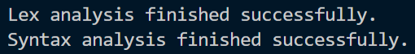
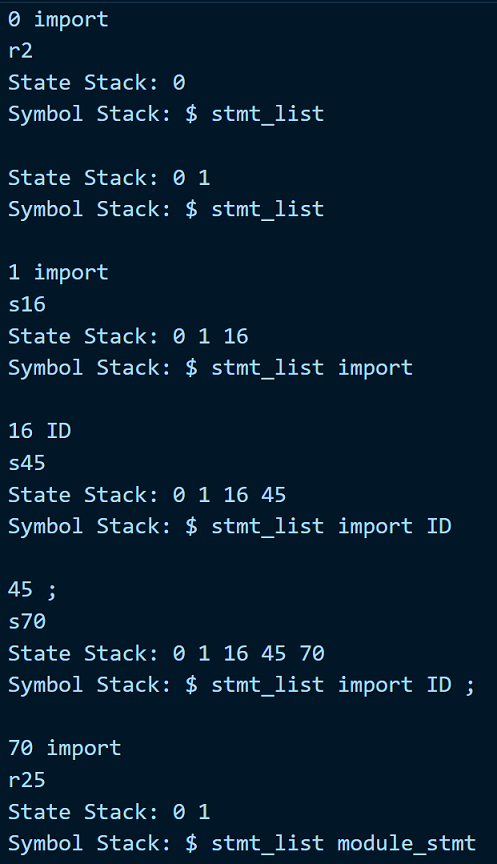

##### 出现错误

###### 无法识别的字符

如，输入汉语的分号：

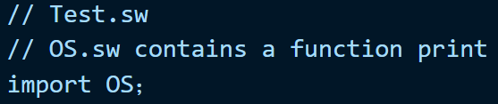

错误提示：

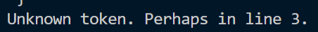

###### ( 不匹配

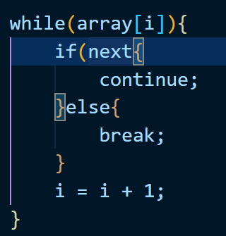

错误提示：

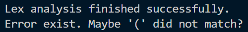

###### [ 不匹配

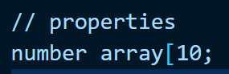

错误提示：

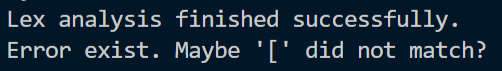

###### { 不匹配

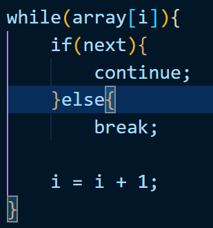

错误提示：

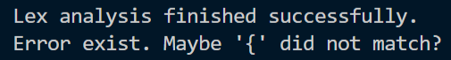

###### 没有以 ; 结尾

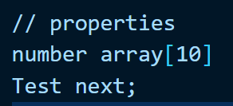

错误提示：

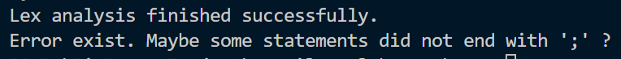

### Ideas / Methods

1. 定义CFG
2. 得到SLR Table。
3. 对lex生成的token进行处理。
4. 基于SLR进行编码。

### Assumptions

出现冲突时，规定如下：

- 默认左结合（因为没有考虑单目运算符）；

- 乘法、除法的优先级高于加法、减法；

- 算术运算符的优先级高于逻辑运算符；

- if-else就近匹配。

### Related FA Descriptions

### Description of Important Data Structures

#### CFG

由于时间紧张，只实现了其中的表达式部分，没有实现声明部分。

主要借鉴了MiniC的语法定义。

##### 声明部分

```
program -> decl_list
decl_list -> decl_list decl
decl_list -> decl
decl -> fun_decl
fun_decl -> export type_spec ID ( params ) compound_stmt
fun_decl -> type_spec ID ( params ) compound_stmt
params -> param_list
params -> void
param_list -> param_list , param
param_list -> param
param -> type_spec ID
param -> type_spec ID [int_literal]
```

##### 表达式部分

```
program -> stmt_list
stmt_list -> stmt_list stmt
stmt_list -> ''
stmt -> expr_stmt
stmt -> decl_stmt
stmt -> module_stmt
stmt -> compound_stmt
stmt -> if_stmt
stmt -> while_stmt
stmt -> return_stmt
stmt -> continue ;
stmt -> break ;
expr_stmt -> ID = expr ;
expr_stmt -> ID [ expr ] = expr ;
expr_stmt -> expr ;
expr_stmt -> ;
decl_stmt -> type_spec ID ;
decl_stmt -> type_spec ID [ int_literal ] ;
type_spec -> void
type_spec -> number
type_spec -> string
type_spec -> function
type_spec -> ID
while_stmt -> while ( expr ) stmt
compound_stmt -> { local_decls stmt_list }
module_stmt -> import ID ;
local_decls -> local_decls local_decl
local_decls -> ''
local_decl -> type_spec ID ;
local_decl -> type_spec ID [ int_literal ] ;
if_stmt -> if ( expr ) stmt
if_stmt -> if ( expr ) stmt else stmt
return_stmt -> return ;
return_stmt -> return expr ;
return_stmt -> ;
expr -> expr == expr
expr -> expr != expr
expr -> expr <= expr
expr -> expr < expr
expr -> expr >= expr
expr -> expr > expr
expr -> expr + expr
expr -> expr - expr
expr -> expr * expr
expr -> expr / expr
expr -> ( expr )
expr -> ID
expr -> ID [ expr ]
expr -> ID ( args )
expr -> int_literal
int_literal -> NUMBER
arg_list -> arg_list , expr
arg_list -> expr
args -> arg_list
args -> ''
```

#### 构建SLR Table的过程

实在写不下，就不写了……

#### SLR Table

已按照定义的规则合并了冲突。

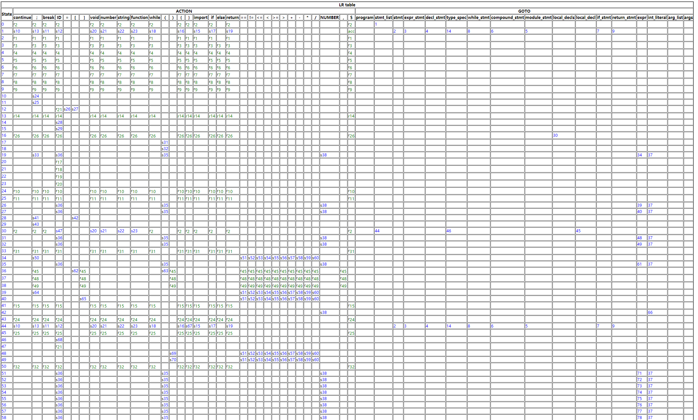
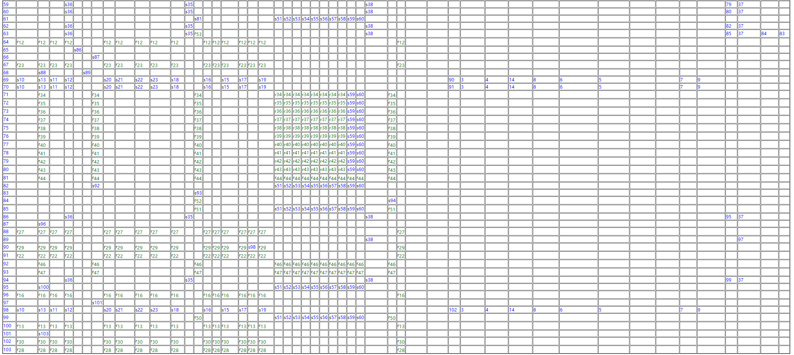

### Description of Core Algorithms

#### 预处理输入

在进行语法分析前，对token中的变量名和数字字面量进行替换。替换后的token如下：

```
import ID ; import ID ; import ID ; while ( ID [ ID ] ) { if ( ID ) { continue ; } else { break ; } ID = ID + NUMBER ; } ID [ ID ] = ( NUMBER + NUMBER * NUMBER / NUMBER ) ; ID ( NUMBER + NUMBER * NUMBER == NUMBER , ID ) ; return NUMBER ;
```

#### 预测语法错误

对括号不匹配和没有用分号结尾的错误进行预测，通过出错后对符号栈中的内容进行计数来实现：

```c++
int brackets = 0;
int square_brackets = 0;
int curly_braces = 0;
for (const string &s : symbol_stack)
{
    if (s == "(")
    {
        ++brackets;
    }
    else if (s == "[")
    {
        ++square_brackets;
    }
    else if (s == "{")
    {
        ++curly_braces;
    }
    else if (s == ")")
    {
        --brackets;
    }
    else if (s == "]")
    {
        --square_brackets;
    }
    else if (s == "}")
    {
        --curly_braces;
    }
}
```

### Use Cases on Running

参见`/Test.sw`。

```c
// Test.sw
// OS.sw contains a function print
import OS;
// Exception.sw contains exception mechanisms
import Exception;
import MathOverflowException;

// properties
number array[10];
Test next;
number i;
i = 0;

while(array[i]){
    if(next){
        continue;
    }else{
        break;
    }
    i = i + 1;
}
array[i] = (2 + 1.0 * 3 / 4.0);
print(1 + 1.0 * 3 == 4, i);

return 0;
```

### Problems Occurred and Related Solutions

1. 可能存在的语法错误很多，暂时没有想到特别有效的预测手段。
2. 错误预测还是很模糊，而且没有精确到行。

### Feelings and Comments

1. 工作量很大，需要更有效的方法。
2. 修复了Lex中的bug……
